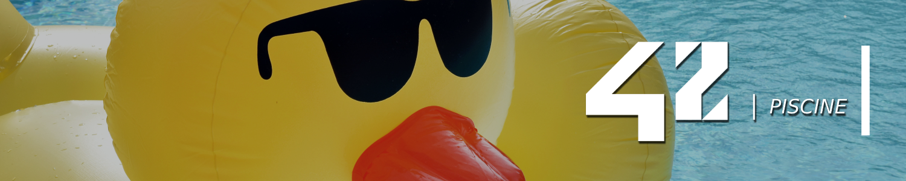

# 🏊🏽‍♂️ 42sp - Piscine

<picture>
	
</picture>
<picture >
	
</picture>
<picture >
	
</picture>
<picture >
	
</picture>

##

In Jun 2023 I participated in School 42's Piscine, a 20 day immersion in programming and selection procedure to see who can initiate as a student at 42.

I share my coding exercises and give a short description of the task and my solution.

(As explicitly allowed by 42. We just cannot share the official PDFs which are property of 42).

The "Piscine" is a distinctive stage of the selection process at 42 São Paulo, following the model of the 42 school, a global network of coding schools. The name "Piscine" is a reference to the intensity and rigor of this process, where candidates are subjected to a series of challenges and tests that last for several consecutive days.

The main phase of the selection process is the "Piscine" This stage is an intensive programming bootcamp that lasts for several weeks. During the Piscine, candidates are subjected to a series of practical challenges that test their programming skills, problem-solving abilities, and teamwork. The idea is to identify candidates with potential, regardless of their academic background or prior programming experience.

## Self-learning

During the process, candidates do not receive traditional lectures or formal instruction. Instead, they have access to online resources and work on practical projects. The goal is for them to learn programming through self-learning and collaboration with other candidates.

## Continuous assessment

Throughout the Piscine, candidates are continuously evaluated. They need to reach specific milestones and complete projects to advance to the next stages of the selection process. Candidates who demonstrate good performance during the Piscine may be approved and invited to join the free education program at 42 São Paulo.

## Results

The results of the Piscine are communicated to the candidates, and those who progress to the next stage continue their learning journey at the school. It's important to note that 42 São Paulo follows an innovative teaching model based on practical learning and collaboration among students. Additionally, the Piscine selection process is known for being challenging and rigorous, with the aim of identifying candidates with the potential and determination to become proficient programmers. Please keep in mind that specific details of the selection process may change over time, so it's always a good idea to check the most up-to-date information on the official 42 São Paulo website or directly contact the school for updated information on the selection process.

## Projects

